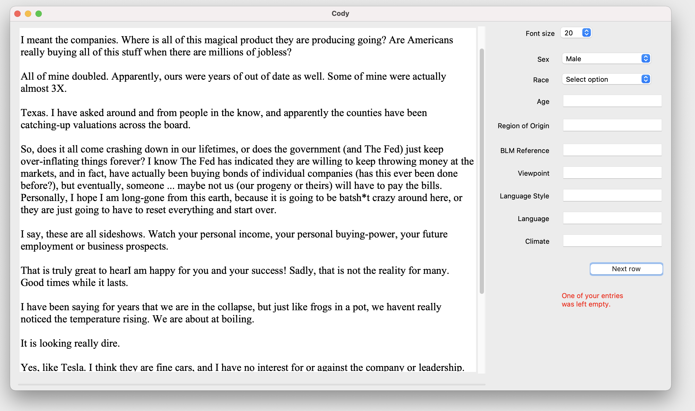

# cody
A desktop app for coding (labeling) data  
*Screenshot of Cody*

## Problem it solves
Coding (labeling) data that consists of long-text entries can be tough. If you import it into Excel, you have to do a combination of shrinking the font, expanding the cell size, and toggling across cells to make your entries. When text entries get to be pretty long, using Excel as your coding environment can be cumbersome and time consuming. 

## How Cody solves it
Cody serves as a desktop UI specifically designed for people who need to code long text datasets. 

## How to get Cody running

## How to use Cody
1. Click "File > Imort CSV" in the menu options. 
2. Select the CSV you're working with
3. Adjust the code settings
4. The first row with missing entries will appear
5. Code away!

## Feedback welcome
Please feel free to share your ideas, bugs found, and features enhancements.
